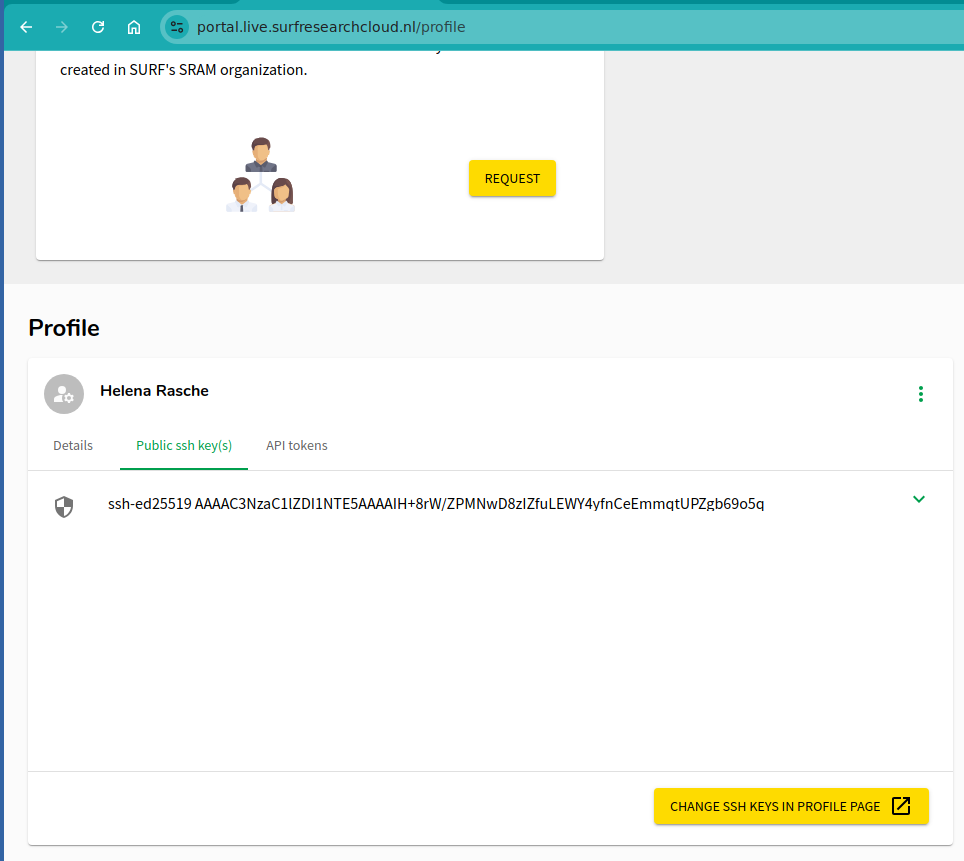
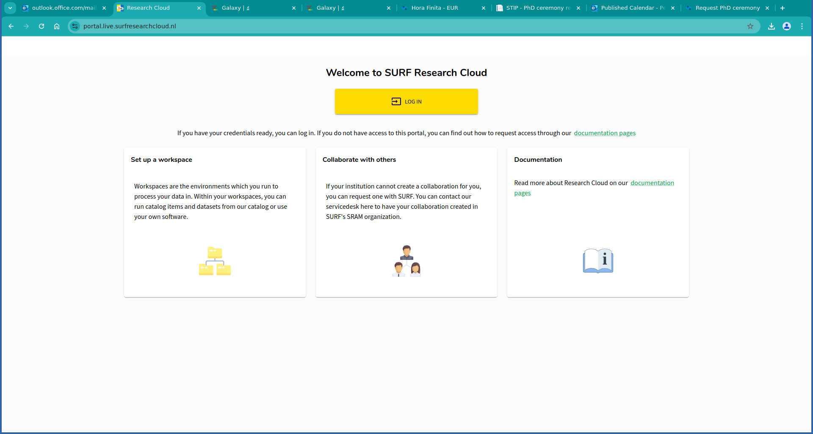
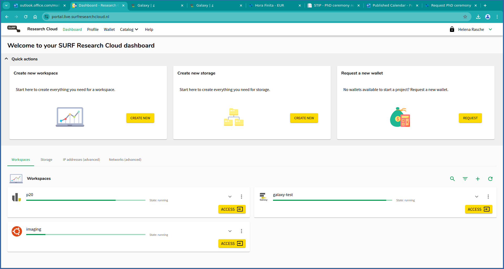
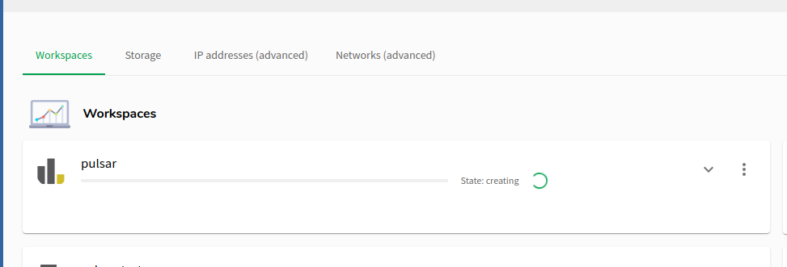

# Pulsar Node on SURF Research Cloud

This repository provides the Ansible playbook for a [Pulsar](https://pulsar.readthedocs.io/) component on SURF Research Cloud (SRC), and serves as the primary documentation for using this Catalog Item.


## Catalog Item Tutorial











access button:


> [!NOTE]  
> Highlights information that users should take into account, even when skimming.

> [!TIP]
> Optional information to help a user be more successful.

> [!IMPORTANT]  
> Crucial information necessary for users to succeed.

> [!WARNING]  
> Critical content demanding immediate user attention due to potential risks.

> [!CAUTION]
> Negative potential consequences of an action.


```diff
 runners:
   local:
     load: galaxy.jobs.runners.local:LocalJobRunner
     workers: 4
   condor:
     load: galaxy.jobs.runners.condor:CondorJobRunner
+  pulsar:
+    load: galaxy.jobs.runners.pulsar:PulsarRESTJobRunner
 
 
 # Uncomment if dynamic handlers are defined in "gravity:handlers" section in galaxy.yml
 #
 handling:
   assign:
   - db-skip-locked
 
 execution:
   default: docker_dispatch
   environments:
     local_destination:
       runner: local
 
     # ... probably some more runners here.
 
+    remote_p20:
+       runner: pulsar
+       url: https://p20.src-sensitive-i.src.surf-hosted.nl
+       private_token: ySgfM1rnGIsiVN8XlfkFhTB5kgp7AZm3jDnd
+       dependency_resolution: remote
+       manager: _default_
+       # Uncomment the following to enable interactive tools:
+       docker_enabled: true
+       docker_set_user: null
+       docker_memory: "8G"
+       singularity_enabled: false
+       tmp_dir: true
+       outputs_to_working_directory: false
+       container_resolvers:
+       - type: explicit
+       require_container: True
+       container_monitor_command: /mnt/pulsar/venv/bin/galaxy-container-monitor
+       container_monitor_result: callback
+       container_monitor_get_ip_method: command:echo p20.src-sensitive-i.src.surf-hosted.nl
 
 
 tools:
 - class: local # these special tools that aren't parameterized for remote execution - expression tools, upload, etc
   environment: local_env
 - id: Cut1
   environment: condor_1x1
+- id: interactive_tool_jupyter_notebook
+  environment: remote_p20
+- id: interactive_tool_rstudio
+  environment: remote_p20
```


## License

GPL-2
